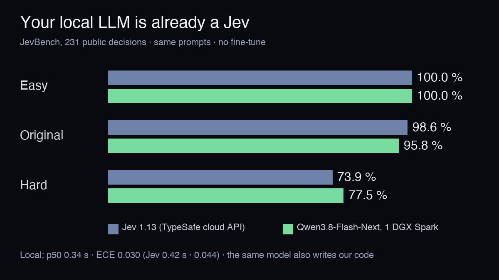
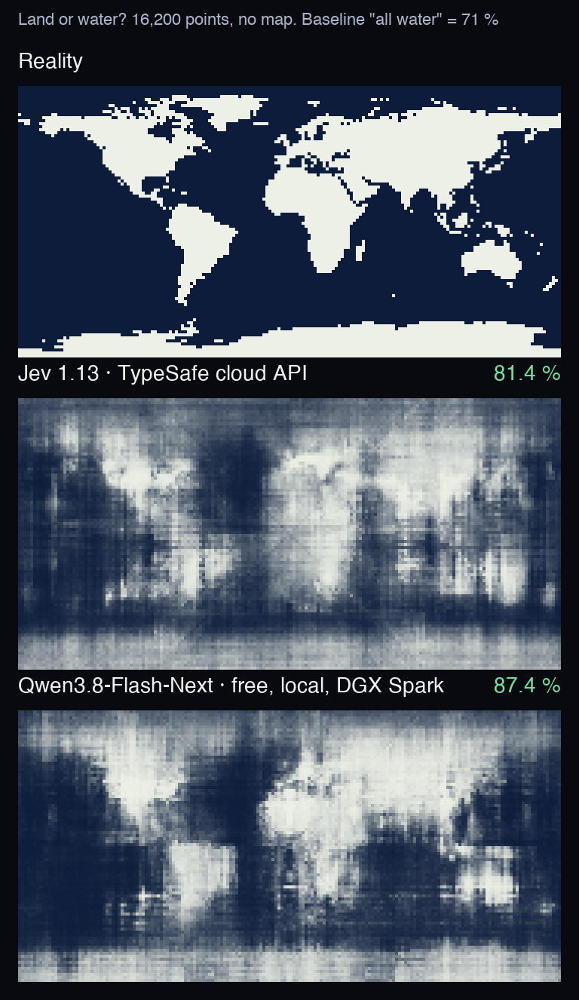

# Your local LLM is already a Jev

A ~150-line server that speaks the [Jev](https://typesafe.ai) `/v1/systemone` API on top of **any local LLM
that returns logprobs** (vLLM, SGLang, TensorFold…). No fine-tune, no second model: the same model that
chats, writes code and runs agents also answers typed decisions.



## How it works

1. Each Jev question becomes a short prompt with lettered options (A, B, C…).
2. The model generates **one token** (`max_tokens: 1`), at **temperature 0**, with thinking off.
3. We read the probabilities of that token (`top_logprobs: 20`) and keep the mass of each letter,
   renormalised over the options. That is the answer: a choice, a yes/no probability or a score.

No text is generated and nothing is parsed. One forward pass per question.

## Results

Same box: one NVIDIA DGX Spark (GB10, 128 GB), `Qwen3.8-Flash-Next` NVFP4
([Mia's recipe](https://github.com/MiaAI-Lab)) on vLLM.

**JevBench** ([fstandhartinger/jevbench](https://github.com/fstandhartinger/jevbench)), the 231 public items,
same requests for both systems:

| | Easy (48) | Original (72) | Hard (111) | ECE | p50 latency |
|---|---|---|---|---|---|
| Jev 1.13 (cloud API) | 100 % | 98.6 % | 73.9 % | 0.044 | 0.42 s |
| Qwen3.8-Flash-Next, local | 100 % | 95.8 % | **77.5 %** | **0.030** | **0.34 s** |

ECE (expected calibration error): when the model says "80 % sure", how far that is from being right 80 % of
the time. Lower is better. The hard-set gap is 4 items out of 111 and the 95 % intervals overlap
(68.9-84.3 vs 65.0-81.1): read it as "on par or better", not as a definitive ranking.
Same weights on [TensorFold](https://github.com/ashhart/TensorFold) 0.6.1: 100 / 95.8 / 78.4 %.

**Blind Earth** (the experiment of [@arithmoquine](https://x.com/arithmoquine),
["How does a blind model see the Earth?"](https://outsidetext.substack.com/p/how-does-a-blind-model-see-the-earth)):
16,200 points on a 2° grid, "is this location over land or water?", no map, no image.



| | Accuracy (per pixel) | Accuracy (by real surface) | Brier |
|---|---|---|---|
| "Water" everywhere | 66.7 % | 71.0 % | — |
| Jev 1.13 | 81.7 % | 81.4 % | 0.132 |
| Qwen3.8-Flash-Next, local | 85.0 % | **87.4 %** | **0.105** |

Both models get worse near the poles (Arctic sea ice, Antarctica).

## Run it

```bash
# 1. any OpenAI-compatible server with logprobs, e.g. vLLM on http://127.0.0.1:8000
# 2. the Jev-compatible server (standard library only)
LLM_URL=http://127.0.0.1:8000 LLM_MODEL=<served model name> python3 systemone_logprobs.py 8021

# 3. a Jev request
curl -s localhost:8021/v1/systemone -d '{
  "state": "Ticket: the customer was charged twice and wants a refund.",
  "questions": {
    "route":   {"type": "choice", "instructions": "Best team?",
                "criteria": {"billing": "payments, refunds", "technical": "bugs", "sales": "new deals"}},
    "angry":   {"type": "noul",   "instructions": "The customer is angry."},
    "urgency": {"type": "score",  "instructions": "Urgency", "criteria": ["none", "low", "medium", "high"]}
  }}'
```

Options: `LLM_MAX_INFLIGHT` (default 2) caps concurrent requests to the model, so batch decisions do not
starve interactive users on the same box; `LLM_PRIORITY` passes a request priority if the server has one.

**JevBench**: clone the benchmark, then point its `typesafe` adapter at the server:
`python3 -m jevbench.cli run --tasks datasets/public/hard.jsonl --adapter typesafe --endpoint http://127.0.0.1:8021 --model local`.

**Blind Earth**: `earth/blind_earth.py` (modes `lp`, `sample`, `think`, `think_lp`, `jev`) and
`earth/score_maps.py` (`pip install global-land-mask pillow numpy`). Our two runs are in `earth/runs/`.

## Limits

- 231 public JevBench items only; the official leaderboard also uses sealed items.
- One run per system; latency measured on a shared box, not under a controlled load.
- At most 20 options per question (the `top_logprobs` cap of most servers).

## Prior art

The idea of reading decisions from next-token logprobs is not new: see
[Cygnet](https://github.com/blockbrain-ai/cygnet-recipe), [localjev](https://github.com/githubnext/localjev),
ollama's `/v1/systemone`, Cloudflare's Clef, and TensorFold's `/v1/decisions`. What we show here is that a
general-purpose local model, served as-is for chat and code, does it at Jev level.

Thanks to [@ashxhart](https://x.com/ashxhart) (TensorFold), [@MiaAI_lab](https://x.com/MiaAI_lab) (DGX Spark
recipes), [@airesearch12](https://x.com/airesearch12) (JevBench) and [@Alibaba_Qwen](https://x.com/Alibaba_Qwen).

MIT license.
